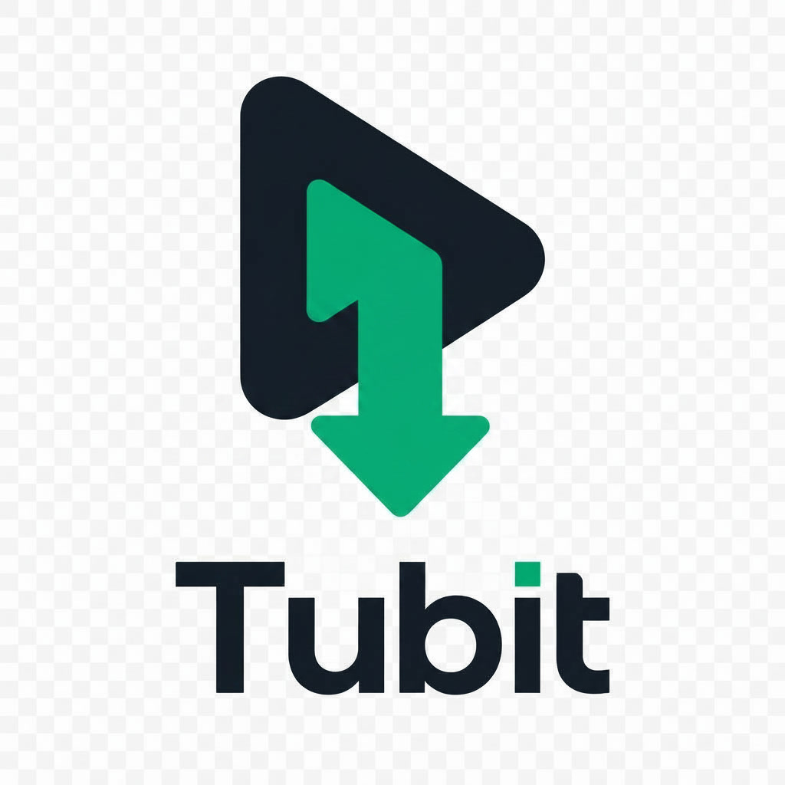
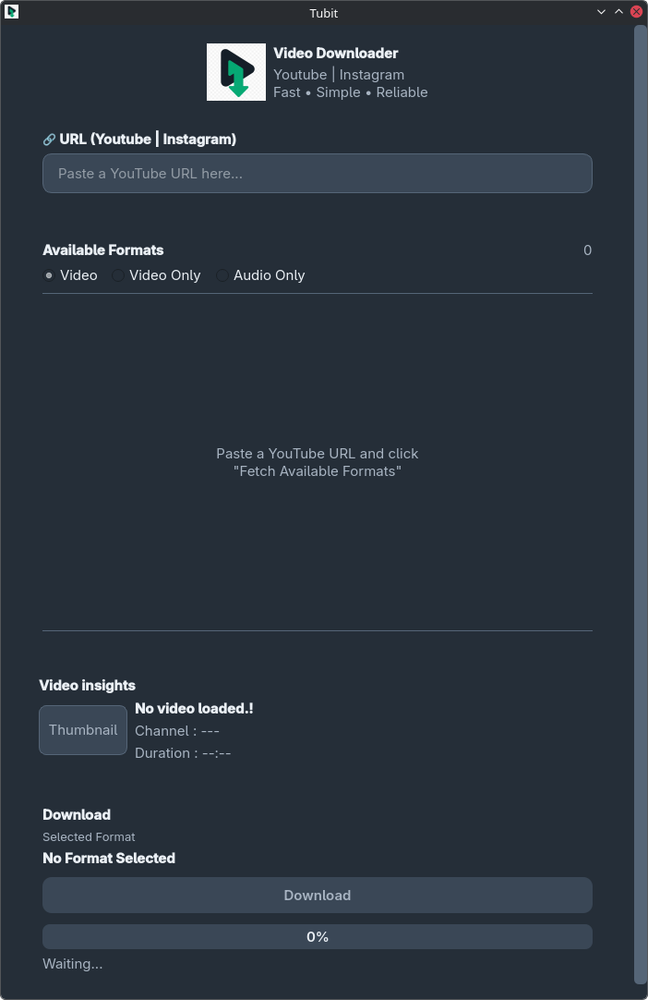

# 🎞️ Tubit

<p align="center">
   
</p>

<p align="center">
   Fast • Simple • Reliable
</p>

**Tubit** is a modern Python desktop application for downloading videos from **YouTube** and **Instagram** using **yt-dlp** and **FFmpeg**. It automatically fetches available formats, lets you choose between Video, Video Only, or Audio Only download modes, and intelligently merges separate video and audio streams when required.

---

## ✨ Features

- 📺 Download videos from **YouTube**.
- 📸 Download videos from **Instagram**.
- 🎥 Fetch all available video and audio formats.
- 🎛️ Choose between Video, Video Only, and Audio Only download modes.
- 🎯 Select the exact quality before downloading.
- 🔍 Smart format filtering for easier selection.
- 🔊 Automatically merges video and audio using **FFmpeg** when necessary.
- ⚡ Real-time download progress.
- 🖥️ Modern desktop interface built with **PySide6**.
- 📦 Supports MP4 and WebM formats.
- 🔍 Displays video information including:
  - Thumbnail
  - Title
  - Channel/Uploader
  - Duration

---

## 🧩 Tech Stack

- **Language:** Python
- **GUI:** PySide6 (Qt)
- **Downloader:** yt-dlp
- **Media Processing:** FFmpeg

---

<p align="center">
  
</p>

---
## 🚀 How to Use

1. Launch **Tubit**.
2. Paste a supported video URL.
3. Click **Fetch Available Formats**.
4. Choose a download mode:
   • Video
   • Video Only
   • Audio Only
5. Select your preferred quality.
6. Click **Download**.
7. Tubit will automatically:
   • Merge best audio (Video mode)
   • Download only video (Video Only)
   • Download only audio (Audio Only)

---

## 🌐 Supported Websites

Currently supported:

- ✅ YouTube
- ✅ Instagram

More websites supported by **yt-dlp** may be added in future updates.

---

## 🔧 Requirements

- Python 3.9+

- Windows:
  - No additional setup required (FFmpeg is bundled with the release).

- Linux:
  - Run run.sh to install all required dependencies including FFmpeg.

---

## 📥 FFmpeg

Tubit uses **FFmpeg** to merge separate video and audio streams for high-quality downloads.

### Windows

The official Windows release bundles **FFmpeg** automatically, so no additional installation is required.

If you are running Tubit from source or prefer using your own FFmpeg installation, you can download it from:

https://ffmpeg.org/download.html

### Linux

Run the provided installation script to install FFmpeg and all required dependencies:

```bash
./install.sh
```

To verify that FFmpeg is installed correctly:

```bash
ffmpeg -version
```

---

## 🚧 Roadmap

Planned features:

- Playlist downloading
- Download history
- Custom download directory
- Subtitle downloading
- Thumbnail embedding
- Batch downloads

---

## 📜 License

This project is licensed under the **MIT License**.

Please also comply with the licenses of:

- yt-dlp
- FFmpeg

---

## 🙏 Credits

- **yt-dlp** — https://github.com/yt-dlp/yt-dlp
- **FFmpeg** — https://ffmpeg.org

---

## 👨‍💻 Developed By

**Lovepreet Singh (Money-Ape)**

GitHub:
https://github.com/Money-Ape

---

⭐ If you find Tubit useful, consider giving the repository a star!